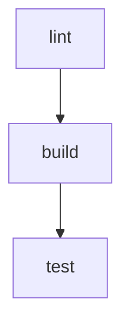

## Введение

В сложных конвейерах GitHub Actions быстро становится трудно понять, какая задача зависит от какой, в каком порядке все выполняется и почему один шаг «ждет» другой. Визуализатор зависимостей dependency-graph помогает превратить текстовый workflow в наглядный граф, где вы сразу видите связи между job, шагами и внешними действиями.

В этой статье я покажу вам, как работать с dependency-graph применительно к GitHub Actions и YAML‑workflow:

- как описывать зависимости между job и шагами;
- как на основе этих зависимостей строится внутренний граф;
- как визуализировать этот граф разными способами;
- как использовать визуализацию для отладки и оптимизации конвейеров.

Мы будем смотреть на примеры YAML‑конфигураций и разбирать, как они превращаются в граф зависимостей, который затем можно анализировать.

---

## Что такое dependency-graph в контексте GitHub Actions

### Понятие графа зависимостей

Смотрите, давайте начнем с базовой теории. Граф зависимостей (dependency graph) в контексте CICD — это ориентированный граф, где:

- вершины — сущности pipeline (job, шаги, внешние действия, артефакты);
- ребра — зависимости, то есть «что должно выполниться до чего».

В GitHub Actions основой графа являются:

- job, связанные директивой `needs`;
- матричные job, которые порождают несколько однотипных вершин;
- условия `if`, которые могут «отключить» вершины;
- артефакты и кеши, которые логически связывают job.

Dependency-graph здесь не просто красивый рисунок. Это модель, по которой раннер решает:

- какие job запускать параллельно;
- что должно дождаться чего;
- как реагировать на ошибки (например, пропускать зависимые job).

### Где появляется dependency-graph в GitHub Actions

Граф зависимостей присутствует на нескольких уровнях:

1. **Внутри одного workflow файла**

   - Визуализируется на вкладке Actions внутри конкретного запуска.
   - Основан на связях `needs` между job.
   - Учитывает условия `if` и стратегии `strategy.fail-fast`.

2. **На уровне репозитория как системы**

   - Через Dependency graph для пакетов и модулей (Packages → Dependency graph).
   - Эта часть касается библиотек и безопасности, но ее часто путают с dependency-graph workflow.
   - В нашей статье фокус — именно на графе зависимостей workflow.

3. **На уровне кода workflow**

   - Вы можете «построить» граф сами, разобрав YAML и зависимости.
   - Это полезно, если вы хотите свой визуализатор или анализатор.

---

## Базовые зависимости job и визуальный граф

### Минимальный пример workflow с зависимостями

Давайте разберемся на простом примере:

```yaml
name: CI

on:
  push:
    branches:
      - main

jobs:
  build:
    runs-on: ubuntu-latest
    steps:
      # Здесь мы компилируем проект
      - name: Build
        run: echo "Building..."

  test:
    needs: build         # Эта job зависит от job build
    runs-on: ubuntu-latest
    steps:
      # Здесь мы запускаем тесты
      - name: Test
        run: echo "Testing..."

  deploy:
    needs: test          # Эта job зависит от job test
    runs-on: ubuntu-latest
    steps:
      # Здесь выполняем деплой
      - name: Deploy
        run: echo "Deploying..."
```

Как видите, мы явно описали зависимости:

- `test` зависит от `build`;
- `deploy` зависит от `test`.

Внутренний dependency-graph для job будет выглядеть так:

`build → test → deploy`

На вкладке Actions GitHub рисует именно такой граф: три блока, соединенные стрелками. Если вы откроете конкретный запуск, сверху будет схематичное представление:

- сначала `build`,
- затем `test`,
- затем `deploy`.

### Параллельные ветви графа

Теперь давайте посмотрим, что происходит, когда часть job не зависит друг от друга:

```yaml
jobs:
  lint:
    runs-on: ubuntu-latest
    steps:
      # Здесь анализируем код линтером
      - name: Lint
        run: echo "Linting..."

  build:
    runs-on: ubuntu-latest
    steps:
      # Здесь собираем проект
      - name: Build
        run: echo "Building..."

  test:
    needs:
      - lint
      - build          # Ждем и линт и сборку
    runs-on: ubuntu-latest
    steps:
      - name: Test
        run: echo "Testing..."
```

Здесь dependency-graph более ветвистый:

- `lint` и `build` независимы и запускаются параллельно;
- `test` ждет, пока завершатся **обе** job.

Визуализатор на Actions покажет два параллельных блока (`lint` и `build`), от которых стрелки сходятся к `test`. Этот граф уже помогает понять, как добиться максимального параллелизма и где вы можете выиграть время.

---

## Как GitHub строит dependency-graph из YAML

### Правила для директивы needs

Теперь давайте разберем, как именно `needs` превращается в граф:

1. **Если у job нет needs**  
   Она не имеет входящих ребер зависимостей, то есть:

   - либо стартует сразу после триггера;
   - либо ее запуск зависит только от глобальных условий.

2. **Если у job одно значение в needs**

   ```yaml
   job-b:
     needs: job-a
   ```

   Это означает, что есть ребро `job-a → job-b`.

3. **Если несколько зависимостей**

   ```yaml
   job-c:
     needs:
       - job-a
       - job-b
   ```

   Это означает:

   - есть ребро `job-a → job-c`;
   - есть ребро `job-b → job-c`;
   - job-c стартует, только когда обе предыдущие job завершены.

4. **Ошибки в графе**

   - Цикличность не допускается (GitHub вернет ошибку валидации).
   - Ссылки на несуществующие job тоже приводят к ошибке.

### Условия if и их влияние на граф

Условие `if` не меняет структуру графа, но влияет на то, какие вершины будут действительно выполнены.

Посмотрите пример:

```yaml
jobs:
  build:
    runs-on: ubuntu-latest
    steps:
      - name: Build
        run: echo "Build"

  test:
    needs: build
    if: github.ref == 'refs/heads/main'   # Условие запуска
    runs-on: ubuntu-latest
    steps:
      - name: Test
        run: echo "Test"
```

Граф по-прежнему:

`build → test`

Но:

- если push идет в ветку main, обе job выполняются;
- если в другую ветку, `test` будет «пропущена» (skipped), хотя останется видимой в графе как пропущенная вершина.

Это важно для визуализации: вы видите структуру и понимаете, какая часть была отключена условиями.

### Матрица job как множитель вершин

Матричные job не меняют структуру графа, но умножают количество вершин.

Давайте посмотрим на пример:

```yaml
jobs:
  build:
    runs-on: ubuntu-latest
    strategy:
      matrix:
        go-version: [1.20, 1.21]  # Две версии Go
    steps:
      - name: Build
        run: |
          echo "Building with Go ${{ matrix.go-version }}"

  test:
    needs: build
    runs-on: ubuntu-latest
    steps:
      - name: Test
        run: echo "Testing..."
```

Dependency-graph логически выглядит так:

- есть две фактические job: `build (1.20)` и `build (1.21)`;
- job `test` будет ждать завершения обеих матричных job, потому что в графе ребра идут от каждой из них к `test`.

На визуализации Actions вы увидите:

- один блок «build» с пометкой о двух вариациях (матрице);
- стрелку от этого блока к `test`.

---

## Практическая визуализация dependency-graph

### Встроенный визуализатор в GitHub Actions

Смотрите, для начала вы можете использовать встроенный визуализатор:

1. Откройте свой репозиторий на GitHub.
2. Перейдите на вкладку Actions.
3. Выберите нужный workflow и конкретный запуск.
4. В верхней части страницы увидите граф job и их связей.

Этот граф:

- строится автоматически по job и директиве `needs`;
- показывает статус каждой вершины (успех, ошибка, пропуск);
- учитывает матрицу (вложенные блоки для вариантов).

Вы не управляете напрямую стилем или детализацией этого графа, но можете сильно повлиять на его читабельность за счет структуры YAML.

### Как сделать граф более понятным

Вот несколько практических советов, как улучшить визуализацию:

1. **Группируйте логически связанные job**

   Вместо одной гигантской job лучше сделать несколько:

   - отдельная job для сборки;
   - отдельная — для тестов;
   - отдельная — для деплоя.

   Тогда граф станет пошаговым и наглядным.

2. **Давайте job понятные имена**

   Вместо абстрактных `job1`, `job2` используйте:

   - `build-backend`;
   - `build-frontend`;
   - `run-e2e-tests`;
   - `deploy-staging`.

   Это названия будут отображаться прямо в графе.

3. **Избегайте длинных линейных цепочек**

   Если в графе 8–10 job строго по цепочке, его трудно читать и сложно оптимизировать. Часть задач можно выполнять параллельно, если вы разделите их на независимые блоки.

4. **Используйте артефакты вместо избыточных зависимостей**

   Частая ошибка — делать job зависимыми только ради того, чтобы «передать» артефакты. Гораздо лучше:

   - в одной job опубликовать артефакты;
   - в других job независимо их скачать.

   Тогда граф отражает именно логические зависимости, а не необходимость обмена файлами.

---

## Расширенный пример сложного dependency-graph

Теперь давайте посмотрим на более сложный, но реальный сценарий:

- вы собираете фронтенд и бэкенд;
- запускаете юнит и интеграционные тесты;
- затем выполняете деплой в staging и production.

```yaml
name: Full CI

on:
  push:
    branches:
      - main
      - staging

jobs:
  lint:
    runs-on: ubuntu-latest
    steps:
      # Здесь запускаем линтер для репозитория
      - name: Lint code
        run: echo "Linting..."

  build-backend:
    needs: lint
    runs-on: ubuntu-latest
    steps:
      # Здесь собираем бэкенд
      - name: Build backend
        run: echo "Building backend..."

  build-frontend:
    needs: lint
    runs-on: ubuntu-latest
    steps:
      # Здесь собираем фронтенд
      - name: Build frontend
        run: echo "Building frontend..."

  unit-tests:
    needs:
      - build-backend
      - build-frontend
    runs-on: ubuntu-latest
    steps:
      # Здесь запускаем юнит-тесты для обеих частей
      - name: Run unit tests
        run: echo "Run unit tests"

  integration-tests:
    needs: unit-tests
    runs-on: ubuntu-latest
    steps:
      # Здесь запускаем интеграционные тесты
      - name: Run integration tests
        run: echo "Run integration tests"

  deploy-staging:
    needs: integration-tests
    if: github.ref == 'refs/heads/staging'
    runs-on: ubuntu-latest
    steps:
      # Здесь деплой в staging
      - name: Deploy to staging
        run: echo "Deploy staging"

  deploy-production:
    needs: integration-tests
    if: github.ref == 'refs/heads/main'
    runs-on: ubuntu-latest
    steps:
      # Здесь деплой в production
      - name: Deploy to production
        run: echo "Deploy prod"
```

Как выглядит dependency-graph в этом случае:

- `lint` — первая вершина, от нее расходятся две ветки:
  - `build-backend`;
  - `build-frontend`.
- От обеих веток стрелки идут к `unit-tests`.
- От `unit-tests` стрелка к `integration-tests`.
- От `integration-tests` стрелки к двум альтернативным деплоям:
  - `deploy-staging` (ветка staging);
  - `deploy-production` (ветка main).

Граф получается разветвленный, но логичный:

- сначала «качество кода»;
- затем независимая сборка;
- затем тесты;
- потом деплой в разные окружения по веткам.

Визуализатор dependency-graph в Actions в таком сценарии отлично показывает всю картину: вы видите ветви, точки слияния и финальные шаги.

---

## Dependency-graph шагов внутри одной job

Встроенный визуализатор GitHub Actions показывает граф на уровне job. Но сами шаги внутри job тоже образуют неявный граф зависимостей:

- по умолчанию шаги идут строго последовательно;
- каждый следующий шаг зависит от успеха предыдущего, если не указано иное.

Посмотрите простой пример:

```yaml
jobs:
  build:
    runs-on: ubuntu-latest
    steps:
      - name: Checkout
        uses: actions/checkout@v4   # Здесь получаем код

      - name: Install deps
        run: npm install            # Устанавливаем зависимости

      - name: Build
        run: npm run build          # Собираем проект

      - name: Upload artifact
        uses: actions/upload-artifact@v4
        with:
          name: build
          path: dist/               # Публикуем сборку
```

Неявный граф шагов:

- `Checkout → Install deps → Build → Upload artifact`.

Вы не можете запускать шаги параллельно в одной job, но можете:

- управлять их выполнением через `if`;
- пропускать отдельные шаги в зависимости от контекста.

Например:

```yaml
      - name: Run e2e tests
        if: github.ref == 'refs/heads/main'   # Выполняем только в main
        run: npm run e2e
```

Внутренний граф по-прежнему линейный, но в некоторых запусках часть вершин помечена как skipped.

---

## Как построить свой визуализатор dependency-graph

Если вам нужно больше, чем встроенная картинка в GitHub, вы можете построить собственный граф на основе YAML‑workflow.

### Общий подход

Давайте посмотрим, как можно это сделать по шагам:

1. **Считать YAML‑файл workflow**

   - Например, `.github/workflows/ci.yml`.
   - Разобрать его в структуру данных (в Go, Python, Node.js — как вам удобнее).

2. **Выделить список job**

   - Это ключи верхнего уровня в секции `jobs`.
   - Каждая job — будущая вершина графа.

3. **Прочитать зависимости needs**

   - Для каждой job получить список `needs`.
   - Для каждого элемента в `needs` добавить ребро графа.

4. **Учитывать матрицы и имена**

   - По желанию можно разворачивать матрицу в несколько вершин.
   - Или оставлять как одну вершину с атрибутом «матрица».

5. **Экспортировать граф**

   - Например, в формат DOT (Graphviz) или Mermaid.
   - Уже потом рисовать с помощью внешних инструментов.

### Пример: генерация графа в формате Mermaid

Mermaid — простой текстовый формат для диаграмм, который хорошо отображается в документации.

Представьте, что у вас есть такой YAML (упрощенный):

```yaml
jobs:
  lint:
    runs-on: ubuntu-latest

  build:
    needs: lint
    runs-on: ubuntu-latest

  test:
    needs: build
    runs-on: ubuntu-latest
```

Логика построения графа такая:

- вершины: lint, build, test;
- ребра:
  - lint → build;
  - build → test.

Теперь вы можете сгенерировать диаграмму Mermaid:



Комментарии поясним:

- граф направленный (TD — top-down, сверху вниз);
- каждая строка `A --> B` — это зависимость «A перед B».

Подставляя job из YAML, вы можете автоматически строить такой текст и, например, включать его в документацию или README.

---

## Работа с несколькими workflow и глобальным графом

В реальных проектах обычно несколько workflow:

- `ci.yml` — сборка и тесты;
- `deploy.yml` — деплой;
- `nightly.yml` — ночные задачи.

GitHub не строит единый dependency-graph между разными workflow, но вы можете связать их с помощью:

- артефактов;
- веток;
- событий (например, `workflow_run`).

### Связывание workflow через workflow_run

Здесь я размещаю пример, чтобы вам было проще понять, как один workflow может запускать другой:

```yaml
# .github/workflows/ci.yml
name: CI

on:
  push:
    branches: [ main ]

jobs:
  build-and-test:
    runs-on: ubuntu-latest
    steps:
      - name: Build and test
        run: echo "CI done"
```

```yaml
# .github/workflows/deploy.yml
name: Deploy

on:
  workflow_run:
    workflows: ["CI"]            # Ждем завершения workflow CI
    types:
      - completed

jobs:
  deploy:
    if: ${{ github.event.workflow_run.conclusion == 'success' }}  # Деплой только при успехе
    runs-on: ubuntu-latest
    steps:
      - name: Deploy
        run: echo "Deploy after CI"
```

Логический dependency-graph между workflow:

`push → CI → Deploy`

Встроенный визуализатор этого целиком не показывает, но вы можете:

- в документации нарисовать такой граф вручную;
- в своем инструменте собрать зависимости, анализируя YAML и события.

---

## Оптимизация pipeline с помощью dependency-graph

Визуализатор зависимостей — это не только удобная картинка, но и инструмент оптимизации.

### Как найти узкие места

Смотрим на граф и задаем себе вопросы:

1. Где самые длинные последовательные цепочки job?
2. Какие job почти ничего не делают, но блокируют запуск следующих?
3. Где можно распараллелить выполнение без ущерба для логики?

Например, если вы видите длинную цепочку:

`lint → build → test → integration-tests → deploy`

и понимаете, что:

- линтер можно запускать параллельно со сборкой;
- часть тестов можно запускать до сборки;

то вы можете изменить dependencies.

### Пример рефакторинга графа

Предположим, у вас есть исходный YAML:

```yaml
jobs:
  build:
    runs-on: ubuntu-latest
    steps:
      - run: echo "Build"

  test:
    needs: build
    runs-on: ubuntu-latest
    steps:
      - run: echo "Test"

  lint:
    needs: test
    runs-on: ubuntu-latest
    steps:
      - run: echo "Lint"
```

Граф:

`build → test → lint`

Но логика странная: линтер не зависит от тестов. Вам удобнее, если:

- `lint` и `test` зависят только от `build`;
- возможно, даже `lint` не зависит от `build`.

Перепишем:

```yaml
jobs:
  build:
    runs-on: ubuntu-latest
    steps:
      - run: echo "Build"

  test:
    needs: build
    runs-on: ubuntu-latest
    steps:
      - run: echo "Test"

  lint:
    runs-on: ubuntu-latest
    steps:
      - run: echo "Lint"
```

Теперь:

- `lint` запускается сразу после триггера;
- `test` ждет только `build`;
- цепочка стала короче, а параллелизм выше.

Dependency-graph после изменений будет более «плоским» и быстрым для исполнения.

---

## Заключение

Dependency-graph в контексте GitHub Actions — это модель того, как связаны между собой job и шаги в вашем workflow. GitHub строит этот граф на основе YAML‑конфигурации, в первую очередь директивы `needs`, а затем отображает его на вкладке Actions.

Если вы осознанно проектируете граф зависимостей:

- pipeline становится проще читать и сопровождать;
- вы быстрее находите проблемные места и узкие горлышки;
- вы можете безопасно увеличивать параллелизм и сокращать общее время выполнения.

Вы можете использовать встроенный визуализатор, а при необходимости — строить собственные графы, разбирая YAML и экспортируя зависимости в форматы вроде Mermaid или Graphviz. Это особенно полезно в больших организациях, где важно понимать общую структуру CICD.

---

## Частозадаваемые технические вопросы по теме

### Как визуализировать dependency-graph локально без GitHub UI

Вы можете разобрать YAML и сгенерировать диаграмму в формате Mermaid или DOT. Минимальный алгоритм:

1. Скриптом (на Python, Go, Node.js) считываете `.github/workflows/*.yml`.
2. Для каждого файла берете секцию `jobs`.
3. Для каждой job собираете список `needs`.
4. Печатаете текст вида:

   - для Mermaid: `jobA --> jobB`;
   - для DOT: `jobA -> jobB;`.

5. Готовый файл рендерите через mermaid-cli или Graphviz.

### Как учесть матрицу job при построении собственного графа

У матричных job есть секция `strategy.matrix`. У вас два варианта:

- не разворачивать матрицу и показывать одну вершину с атрибутом «матрица»;
- разворачивать: для каждой комбинации значений создавать отдельную вершину, например `build[go=1.20]`, `build[go=1.21]`, и от каждой из них вести ребра к зависящим job.

Выбор зависит от того, насколько вам важны отдельные вариации.

### Можно ли в одной job моделировать нестандартный граф шагов

В рамках одной job шаги всегда выполняются последовательно, так устроен раннер. Но вы можете:

- условно пропускать шаги через `if`;
- запускать параллельные подпроцессы внутри одного шага (например, `&` в bash или `npm-run-all`), хотя это уже не отображается в dependency-graph и усложняет отладку.

Если нужен полноценный граф, лучше разбить на несколько job с `needs`.

### Как отобразить зависимости между несколькими workflow

GitHub не строит общий граф, но вы можете сами:

1. Найти workflow, использующие `workflow_run` или `repository_dispatch`.
2. Для каждого такого workflow добавить ребра:
   - `source-workflow → target-workflow`.
3. Описать事件 триггера (тип события, ветка) как подпись к ребру.
4. Визуализировать такой меж-workflow граф отдельно (Mermaid, DOT).

### Как отразить в графе зависимость через артефакты

Артефакты и кеши не создают явных ребер, но вы можете учитывать их так:

1. Ищите шаги с `uses: actions/upload-artifact` и `uses: actions/download-artifact`.
2. Для каждой пары «upload» → «download» добавляйте логическое ребро между соответствующими job.
3. В итоговой диаграмме помечайте такие ребра отдельным стилем (например, пунктирной линией), чтобы отличать их от `needs`.